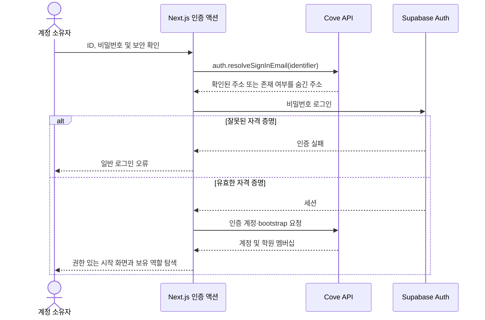
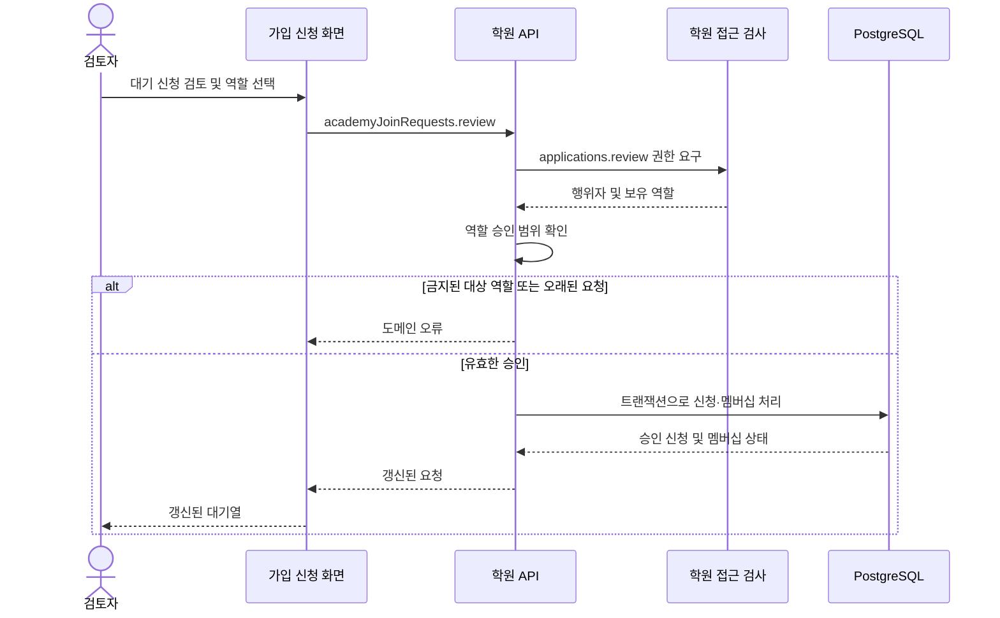
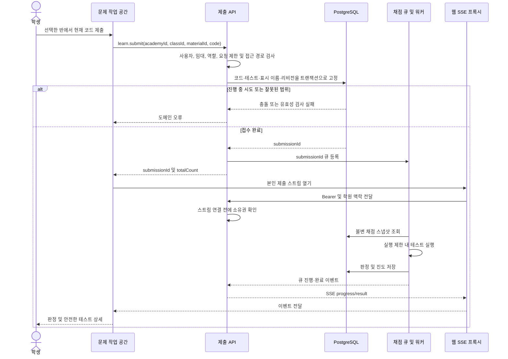
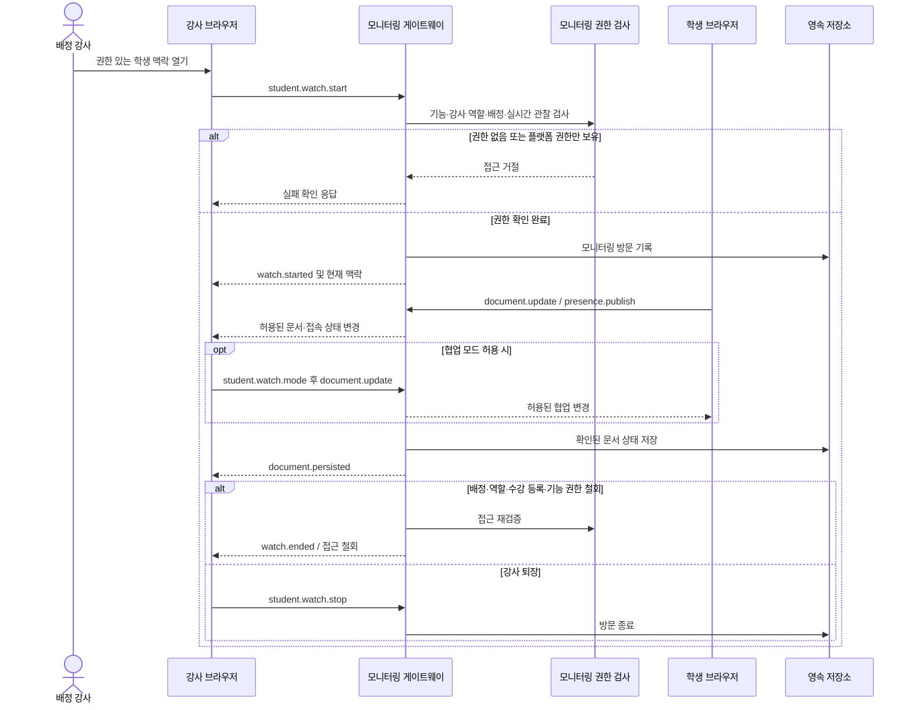
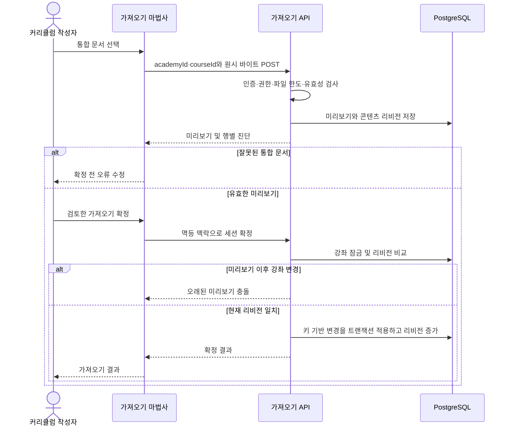
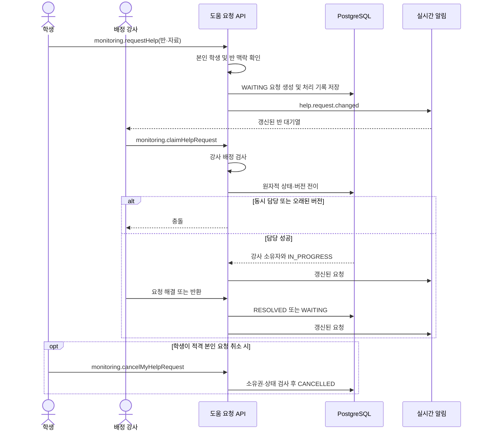
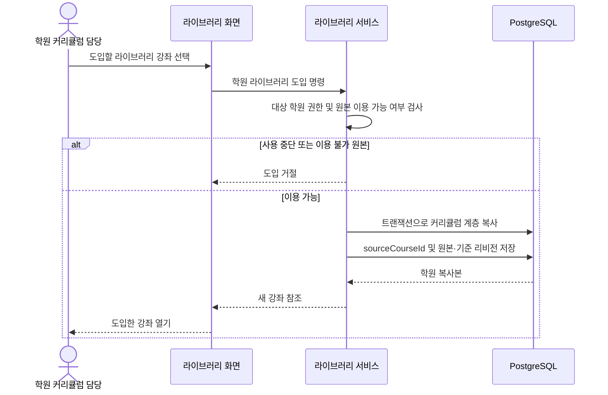
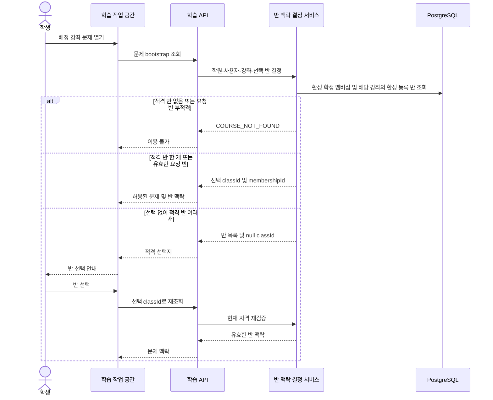
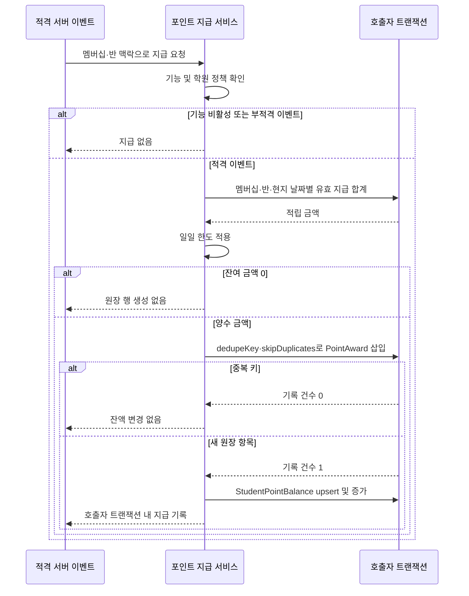
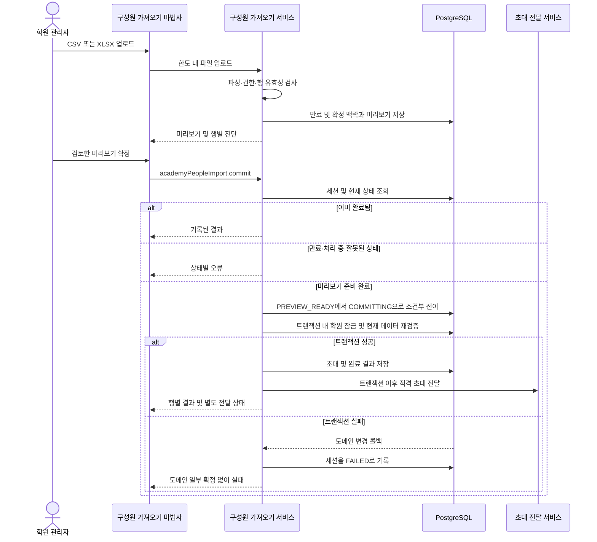

# Cove Studio v2 시퀀스 다이어그램

담당: John. 기준: feat/cove-studio-v2 / b095b679. 기존 업무 흐름의 상호작용을 설명하며 별도로 완료된 아키텍처·사용자 흐름을 보완합니다. 정확한 페이로드는 API 계약을 참조하십시오.

## SQ-01 로그인 및 역할별 화면 이동

요구사항: FR-AUTH, FR-ROLE. 소스: `packages/web/src/app/(auth)/actions.ts; packages/api/src/auth/auth.router.ts; packages/web/src/lib/orpc-server.ts`.

## SQ-02 가입 신청 승인

요구사항: FR-JOIN. 소스: `packages/api/src/academies/academy-join-request.service.ts; packages/shared/src/auth/roles.ts`.

## SQ-03 제출 채점 및 결과 전달

요구사항: FR-GRADE, FR-RESULT. 소스: `packages/api/src/learn/submission.service.ts; packages/api/src/learn/submission.controller.ts; packages/api/src/judge`.

## SQ-04 강사 실시간 관찰 및 권한 철회

요구사항: FR-MONITOR, FR-DRAFT. 소스: `packages/api/src/monitoring/monitoring.gateway.ts; packages/api/src/monitoring/monitoring-access.service.ts`.

## SQ-05 커리큘럼 파일 미리보기 및 확정

요구사항: FR-IMPORT. 소스: `packages/api/src/content/import/content-import.controller.ts; packages/api/src/content/import/content-import.service.ts`.

## SQ-06 학생 도움 대기열

요구사항: FR-HELP. 소스: `packages/api/src/monitoring/help-request.service.ts; packages/shared/src/monitoring/help-requests.ts`.

## SQ-07 라이브러리 도입

요구사항: FR-LIBRARY. 소스: `packages/api/src/content/library/academy-library.service.ts; packages/api/prisma/schema.prisma`.

## SQ-08 공유 강좌의 반 맥락

요구사항: FR-CLASS, FR-LEARN, FR-POINTS. 소스: `packages/api/src/learn/learning-class-context.service.ts`. 소스 기준 상호작용이며 운영 플랫폼에서 변경 경로를 실행하지 않았습니다.

## SQ-09 보상 원장 및 중복 방지

요구사항: FR-POINTS, FR-GRADE. 소스: `packages/api/src/points/point-award.service.ts`. 소스 기준 상호작용이며 운영 플랫폼에서 변경 경로를 실행하지 않았습니다.

## SQ-10 구성원 가져오기 미리보기 및 확정

요구사항: FR-PEOPLE, FR-JOIN. 소스: `packages/api/src/manage/people-import.service.ts`. 소스 기준 상호작용이며 운영 플랫폼에서 변경 경로를 실행하지 않았습니다.

