# Cove Studio v2 화면 참조

2026년 9월 28일 https://cs.coveedu.com/에서 캡처한 실제 화면 47개입니다. 관찰 당시 화면을 잘라 사용했으며 PowerPoint 설명은 편집 가능합니다. 소스 기반 규칙은 기능 명세서를 참조하십시오. 내부 팀용 자료로 필요한 검토 계정·직원명·강좌명이 일부 보입니다. 비밀번호와 토큰은 포함하지 않습니다. 스크린샷 안의 원래 UI 언어는 유지했습니다.

| 화면 | 역할 | 제목 | 요구사항 |
|---|---|---|---|
| U01 | 모든 역할 | [ID 로그인](02-screenshots/U01.png) | FR-AUTH |
| U02 | 비로그인 사용자 | [학생 가입](02-screenshots/U02.png) | FR-AUTH, FR-JOIN |
| U03 | 비로그인 사용자 | [직원 가입](02-screenshots/U03.png) | FR-AUTH, FR-JOIN |
| U04 | 비로그인 사용자 | [비밀번호 복구](02-screenshots/U04.png) | FR-AUTH |
| A01 | 플랫폼 관리자 | [학원 목록](02-screenshots/A01.png) | FR-ADMIN |
| A02 | 플랫폼 관리자 | [학원 상세 점검](02-screenshots/A02.png) | FR-ADMIN, FR-ANALYTICS |
| A03 | 플랫폼 관리자 | [플랫폼 기능 제어](02-screenshots/A03.png) | FR-ADMIN, FR-UX |
| A04 | 플랫폼 관리자 | [포인트 정책 비교](02-screenshots/A04.png) | FR-POINTS |
| A05 | 플랫폼 관리자 | [포인트 정책 편집](02-screenshots/A05.png) | FR-POINTS |
| A06 | 플랫폼 관리자 | [재채점 관리](02-screenshots/A06.png) | FR-OPS |
| A07 | 플랫폼 관리자 | [지원 접근 이력](02-screenshots/A07.png) | FR-SUPPORT |
| A08 | 플랫폼 관리자 | [감사 이력](02-screenshots/A08.png) | FR-SUPPORT |
| A09 | 플랫폼 관리자 | [플랫폼 원본 라이브러리](02-screenshots/A09.png) | FR-LIBRARY |
| A10 | 플랫폼 관리자 | [원본 강좌 생성](02-screenshots/A10.png) | FR-LIBRARY |
| A11 | 플랫폼 관리자 | [플랫폼 사용자 목록](02-screenshots/A11.png) | FR-ADMIN |
| A12 | 플랫폼 관리자 | [가입 신청 대기열](02-screenshots/A12.png) | FR-JOIN |
| A13 | 플랫폼 관리자 | [초대 전달 현황](02-screenshots/A13.png) | FR-JOIN |
| A14 | 플랫폼 관리자 | [초대 입력 폼](02-screenshots/A14.png) | FR-JOIN |
| M01 | 학원 관리자 | [학원 관리자 개요](02-screenshots/M01.png) | FR-ANALYTICS |
| M02 | 학원 관리자 | [반 목록](02-screenshots/M02.png) | FR-CLASS, FR-STAFF |
| M03 | 학원 관리자 | [반 생성 대화상자](02-screenshots/M03.png) | FR-CLASS |
| M04 | 학원 관리자 | [반 상세](02-screenshots/M04.png) | FR-CLASS |
| M05 | 학원 관리자 | [반 시간표](02-screenshots/M05.png) | FR-CLASS, FR-POINTS |
| M06 | 학원 관리자 | [학원 구성원 목록](02-screenshots/M06.png) | FR-PEOPLE, FR-ROLE |
| M07 | 학원 관리자 | [구성원 파일 가져오기](02-screenshots/M07.png) | FR-PEOPLE |
| M08 | 학원 관리자 | [학원 기능 설정](02-screenshots/M08.png) | FR-UX, FR-POINTS |
| L01 | 팀장 | [커리큘럼 준비 상태](02-screenshots/L01.png) | FR-COURSE, FR-ANALYTICS |
| L02 | 팀장 | [강좌 목록](02-screenshots/L02.png) | FR-COURSE, FR-LIBRARY |
| L03 | 팀장 | [강좌 계층](02-screenshots/L03.png) | FR-COURSE |
| L04 | 팀장 | [Excel 가져오기 준비](02-screenshots/L04.png) | FR-IMPORT |
| L05 | 팀장 | [문제 작성 필드](02-screenshots/L05.png) | FR-COURSE |
| L06 | 팀장 | [테스트 및 힌트](02-screenshots/L06.png) | FR-COURSE, FR-GRADE |
| L07 | 팀장 | [학원 콘텐츠 라이브러리](02-screenshots/L07.png) | FR-LIBRARY |
| T01 | 강사 | [강사 지도 대기 목록](02-screenshots/T01.png) | FR-ANALYTICS |
| T02 | 강사 | [배정 반](02-screenshots/T02.png) | FR-MONITOR |
| T03 | 강사 | [오프라인 실시간 명단](02-screenshots/T03.png) | FR-MONITOR |
| T04 | 강사 | [학생 진도 상세](02-screenshots/T04.png) | FR-RESULT |
| T05 | 강사 | [강사 분석](02-screenshots/T05.png) | FR-ANALYTICS |
| S01 | 학생 | [학생 개요](02-screenshots/S01.png) | FR-LEARN, FR-ANALYTICS |
| S02 | 학생 | [학습 반 선택](02-screenshots/S02.png) | FR-CLASS |
| S03 | 학생 | [Python 문제 작업 공간](02-screenshots/S03.png) | FR-LEARN, FR-DRAFT, FR-GRADE |
| S04 | 학생 | [제출 전 결과 패널](02-screenshots/S04.png) | FR-RESULT |
| S05 | 학생 | [답안 이력](02-screenshots/S05.png) | FR-RESULT |
| S06 | 학생 | [내 포인트](02-screenshots/S06.png) | FR-POINTS |
| S07 | 학생 | [학생 반 목록](02-screenshots/S07.png) | FR-CLASS |
| S08 | 학생 | [학생 강좌 및 초안](02-screenshots/S08.png) | FR-LEARN, FR-DRAFT |
| S09 | 학생 | [계정 프로필](02-screenshots/S09.png) | FR-PROFILE |

## U01 ID 로그인

역할: 모든 역할. 요구사항: FR-AUTH.

동작: 보안 확인 후 ID와 비밀번호로 로그인합니다. Google·Naver 로그인도 제공합니다.

검증 범위: 정상 로그인을 관찰했습니다. 외부 인증 완료와 로그인 실패는 스테이징 테스트가 필요합니다.

출처: https://cs.coveedu.com/login

캡처 시각: 2026-09-28T08:05:27.562Z. 자르기 좌표: [800, 32, 1365, 752].

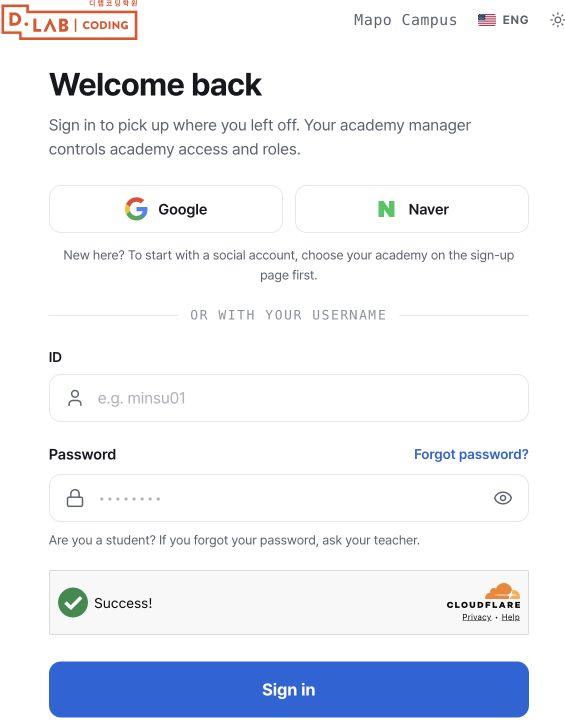

## U02 학생 가입

역할: 비로그인 사용자. 요구사항: FR-AUTH, FR-JOIN.

동작: 학원과 계정 유형을 선택합니다. 학생은 이메일 없이 이름, ID, 비밀번호와 확인 값을 입력합니다.

검증 범위: ID는 허용 문자 5~30자, 비밀번호는 최소 8자입니다. 계정 유형 선택만으로 학원 역할이 부여되지 않습니다.

출처: https://cs.coveedu.com/signup

캡처 시각: 2026-09-28T08:18:53.975Z. 자르기 좌표: [800, 32, 1365, 705].

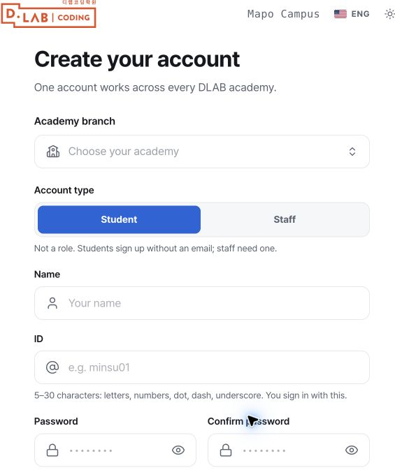

## U03 직원 가입

역할: 비로그인 사용자. 요구사항: FR-AUTH, FR-JOIN.

동작: 직원 선택 시 이메일 입력란이 추가됩니다. 학원 승인 또는 초대가 최종 역할을 결정합니다.

검증 범위: 폼 상단을 캡처했습니다. 비밀번호, 보안 확인 및 제출 제어는 아래에 이어집니다.

출처: https://cs.coveedu.com/signup

캡처 시각: 2026-09-28T08:18:54.633Z. 자르기 좌표: [800, 32, 1365, 705].

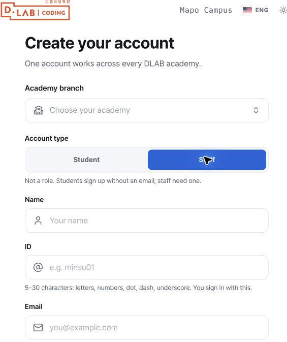

## U04 비밀번호 복구

역할: 비로그인 사용자. 요구사항: FR-AUTH.

동작: 첫 단계에서 로그인 ID를 입력합니다. 이메일 링크를 통한 새 비밀번호 설정을 안내합니다.

검증 범위: 캡처 당시 보안 확인 대기 상태입니다. 복구 메시지를 요청하지 않았습니다.

출처: https://cs.coveedu.com/forgot-password

캡처 시각: 2026-09-28T08:19:25.449Z. 자르기 좌표: [800, 32, 1365, 681].

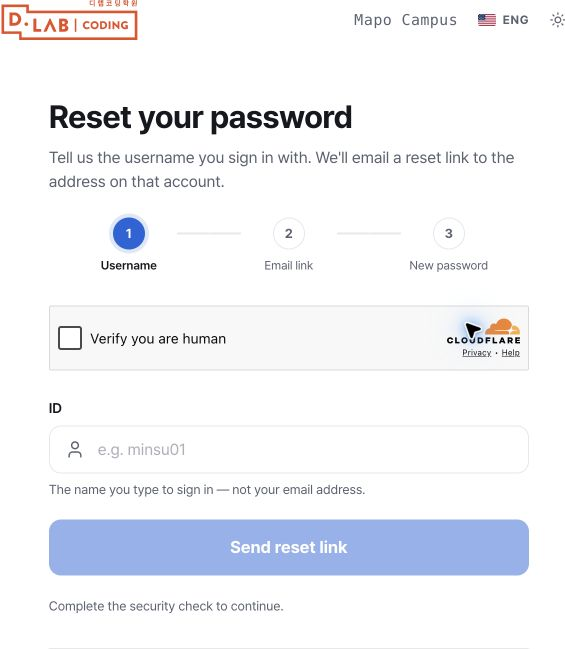

## A01 학원 목록

역할: 플랫폼 관리자. 요구사항: FR-ADMIN.

동작: 학원명·주소 검색과 상태 필터로 학원 상세를 엽니다. 조치 필요 영역은 운영 누락을 표시합니다.

검증 범위: 검토 시 목록에는 학원 3개가 있었습니다. 화면 수치는 관찰값이며 고정 요구사항이 아닙니다.

출처: https://cs.coveedu.com/admin/academies

캡처 시각: 2026-09-28T05:06:09.052Z. 자르기 좌표: [280, 75, 1405, 710].

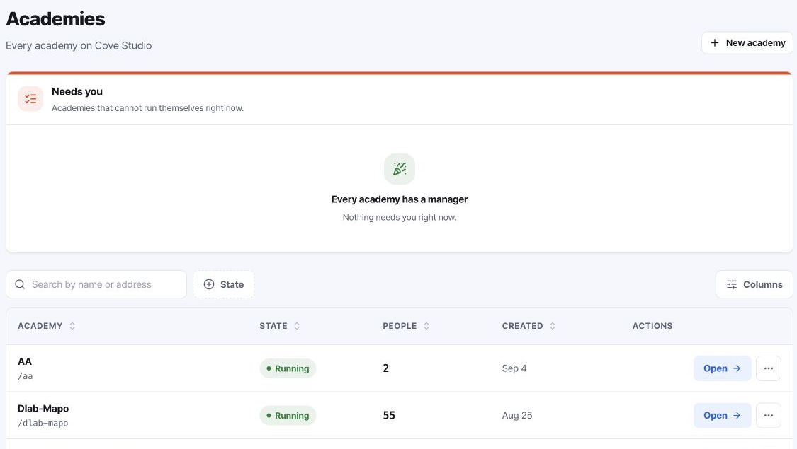

## A02 학원 상세 점검

역할: 플랫폼 관리자. 요구사항: FR-ADMIN, FR-ANALYTICS.

동작: 구성원, 반, 강좌 수와 커리큘럼 준비 상태 경고를 함께 표시합니다.

검증 범위: 강사 미배정 11건 경고가 학원 관리자 화면의 배정과 다릅니다. REV-01을 참조하십시오.

출처: https://cs.coveedu.com/admin/academies/dlab-mapo

캡처 시각: 2026-09-28T05:07:38.142Z. 자르기 좌표: [280, 75, 1405, 740].

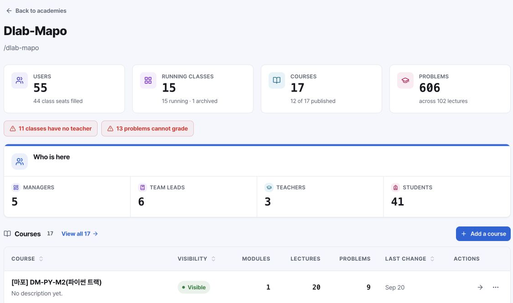

## A03 플랫폼 기능 제어

역할: 플랫폼 관리자. 요구사항: FR-ADMIN, FR-UX.

동작: 학원별로 실시간 모니터링, 반 현황, 포인트 및 반 순위를 독립 설정합니다.

검증 범위: 활성화된 설정을 캡처했습니다. 이번 검토에서 스위치를 변경하지 않았습니다.

출처: https://cs.coveedu.com/admin/settings

캡처 시각: 2026-09-28T05:07:53.325Z. 자르기 좌표: [280, 75, 1405, 710].

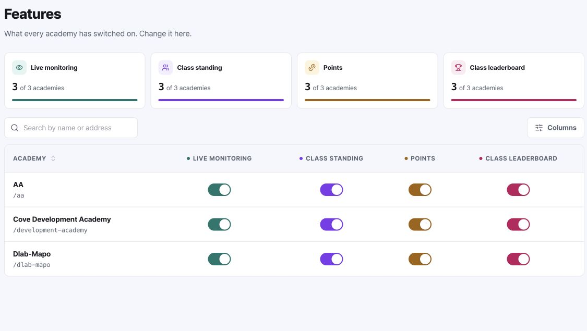

## A04 포인트 정책 비교

역할: 플랫폼 관리자. 요구사항: FR-POINTS.

동작: 학원별 기본·사용자 지정 보상과 일일 한도를 비교합니다.

검증 범위: Dlab-Mapo의 어려운 문제 보상은 15P입니다. 소스 기본값은 10P입니다.

출처: https://cs.coveedu.com/admin/settings/points

캡처 시각: 2026-09-28T05:08:06.700Z. 자르기 좌표: [280, 75, 1405, 710].

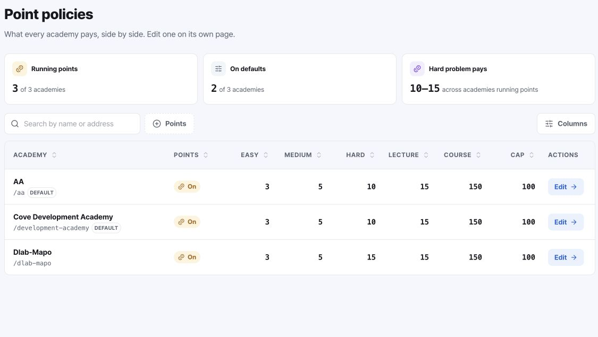

## A05 포인트 정책 편집

역할: 플랫폼 관리자. 요구사항: FR-POINTS.

동작: 풀이·완료 보상은 별도 필드입니다. 저장, 취소, 기본값 복원은 서로 다른 작업입니다.

검증 범위: 폼 상단입니다. 출석, 학습 구간, 일일 한도 및 학생 미리보기는 아래에 이어집니다.

출처: https://cs.coveedu.com/admin/academies/dlab-mapo/settings/points

캡처 시각: 2026-09-28T05:08:52.037Z. 자르기 좌표: [280, 75, 1405, 710].

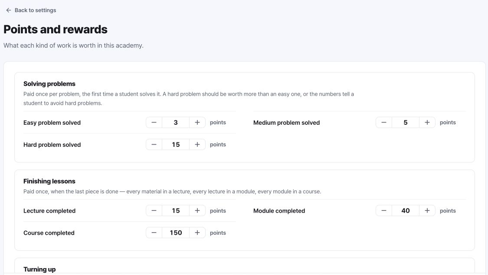

## A06 재채점 관리

역할: 플랫폼 관리자. 요구사항: FR-OPS.

동작: 학원 선택 후 문제를 선택하고 재채점을 계획합니다. 현재 진도와 최초 시도 이력을 구분합니다.

검증 범위: 재채점을 계획하거나 실행하지 않았습니다. 대기·실패·완료 상태는 통제된 테스트가 필요합니다.

출처: https://cs.coveedu.com/admin/operations

캡처 시각: 2026-09-28T05:09:04.600Z. 자르기 좌표: [280, 75, 1405, 743].

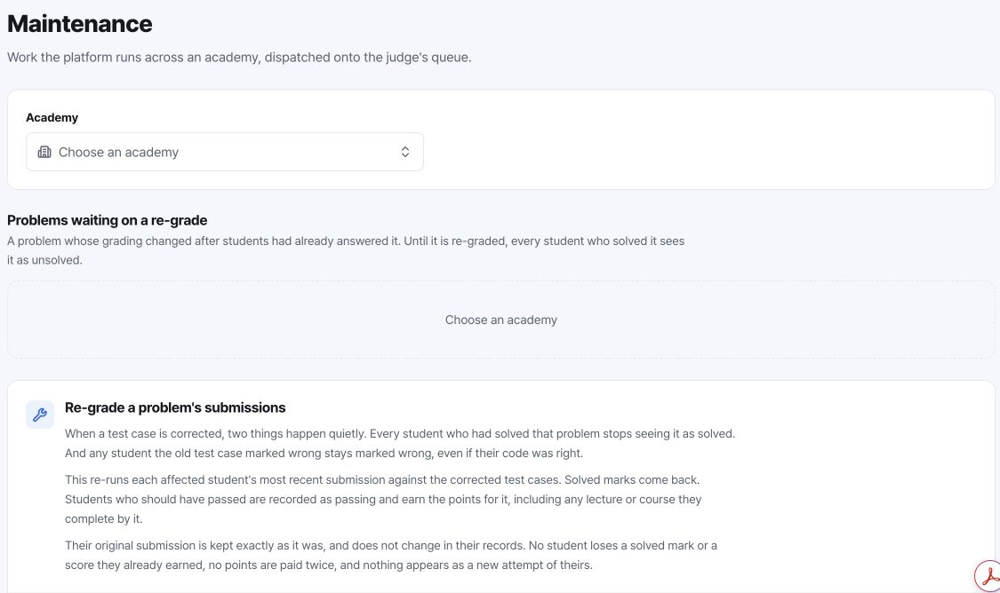

## A07 지원 접근 이력

역할: 플랫폼 관리자. 요구사항: FR-SUPPORT.

동작: 열린 지원 세션과 과거 권한의 학원, 사유, 역할 및 제한을 표시합니다.

검증 범위: 철회된 세션 2개를 확인했습니다. 새 지원 권한은 생성하지 않았습니다.

출처: https://cs.coveedu.com/admin/access

캡처 시각: 2026-09-28T05:10:03.563Z. 자르기 좌표: [280, 75, 1405, 710].

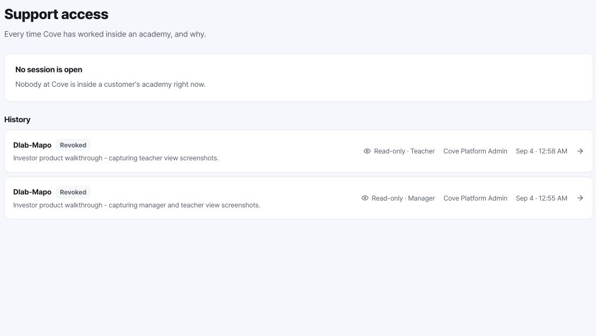

## A08 감사 이력

역할: 플랫폼 관리자. 요구사항: FR-SUPPORT.

동작: 날짜별로 최신 이벤트부터 행위자, 학원 및 시각을 표시합니다.

검증 범위: 이벤트 표시 방식의 실제 캡처입니다. 모든 감사 대상 작업을 검증한 것은 아닙니다.

출처: https://cs.coveedu.com/admin/audit

캡처 시각: 2026-09-28T05:10:42.224Z. 자르기 좌표: [280, 75, 1405, 710].

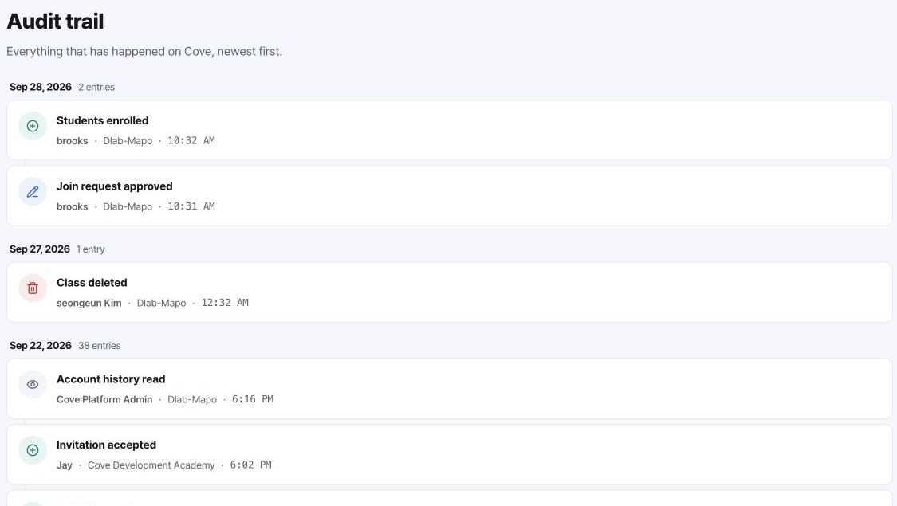

## A09 플랫폼 원본 라이브러리

역할: 플랫폼 관리자. 요구사항: FR-LIBRARY.

동작: 게시 원본 강좌의 계층 수, 도입 범위 및 원본보다 뒤처진 복사본을 표시합니다.

검증 범위: 경고 배지는 채점 불가 콘텐츠를 나타냅니다. 게시·배포는 실행하지 않았습니다.

출처: https://cs.coveedu.com/admin/content/library

캡처 시각: 2026-09-28T05:11:04.930Z. 자르기 좌표: [280, 75, 1405, 710].

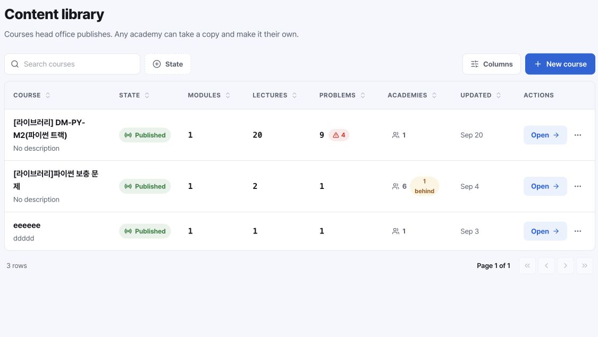

## A10 원본 강좌 생성

역할: 플랫폼 관리자. 요구사항: FR-LIBRARY.

동작: 필수 강좌 제목과 학원에 제공할 내용의 선택 설명을 입력합니다.

검증 범위: 새 원본은 초안 상태입니다. 빈 폼에서는 생성 후 열기가 비활성화됩니다.

출처: https://cs.coveedu.com/admin/content/library

캡처 시각: 2026-09-28T05:11:18.667Z. 자르기 좌표: [464, 129, 977, 650].

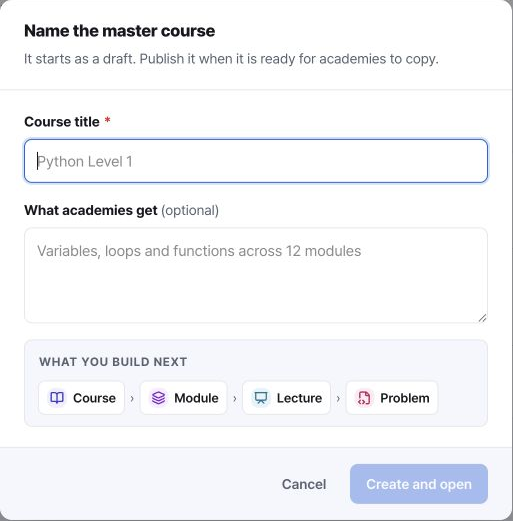

## A11 플랫폼 사용자 목록

역할: 플랫폼 관리자. 요구사항: FR-ADMIN.

동작: 학원, 역할, 계정·멤버십 상태로 검색·필터링합니다. 내보내기와 계정 작업은 별도 제어입니다.

검증 범위: 제공된 관리자 계정으로 필터링한 목록을 캡처했습니다.

출처: https://cs.coveedu.com/admin/users?q=Cove+Platform+Admin

캡처 시각: 2026-09-28T05:15:26.141Z. 자르기 좌표: [280, 75, 1405, 710].

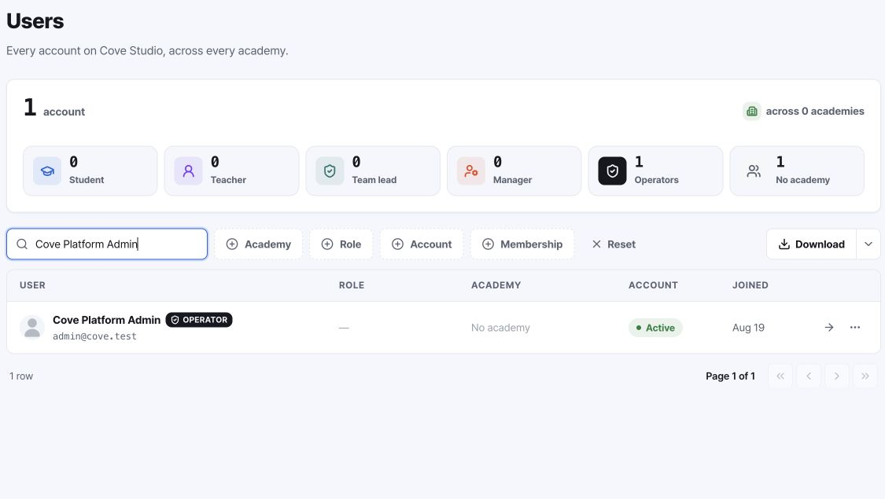

## A12 가입 신청 대기열

역할: 플랫폼 관리자. 요구사항: FR-JOIN.

동작: 학원·상태·조치 필요 필터와 대기 요약을 제공합니다.

검증 범위: 운영 대기열은 비어 있습니다. 승인·거절·오래된 검토 규칙은 소스와 미실행 QA를 참조합니다.

출처: https://cs.coveedu.com/admin/applications

캡처 시각: 2026-09-28T05:15:44.516Z. 자르기 좌표: [280, 75, 1405, 710].

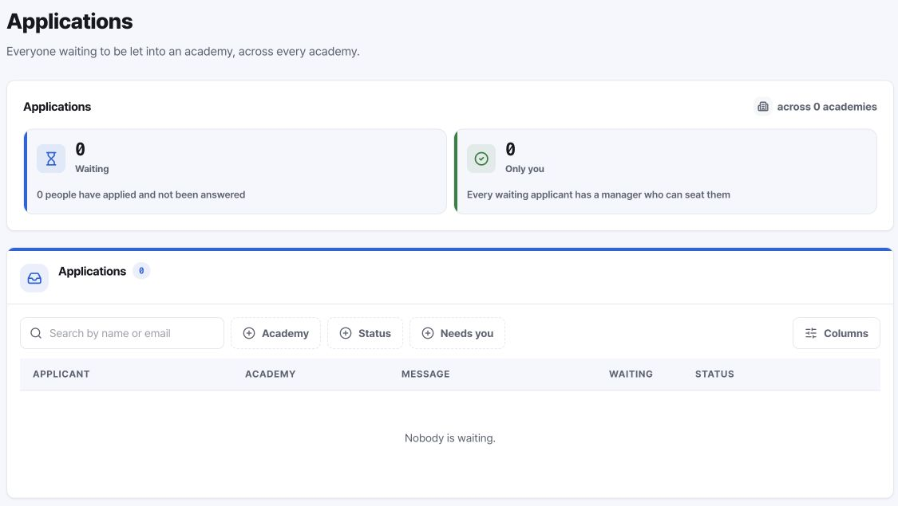

## A13 초대 전달 현황

역할: 플랫폼 관리자. 요구사항: FR-JOIN.

동작: 전체 초대, 대기 초대 및 전달 실패 요약을 표와 별도로 표시합니다.

검증 범위: 요약은 7건이나 표는 비어 있습니다. 일치 확인 완료가 아닌 검토 항목으로 기록합니다.

출처: https://cs.coveedu.com/admin/invitations

캡처 시각: 2026-09-28T08:04:45.580Z. 자르기 좌표: [280, 75, 1405, 710].

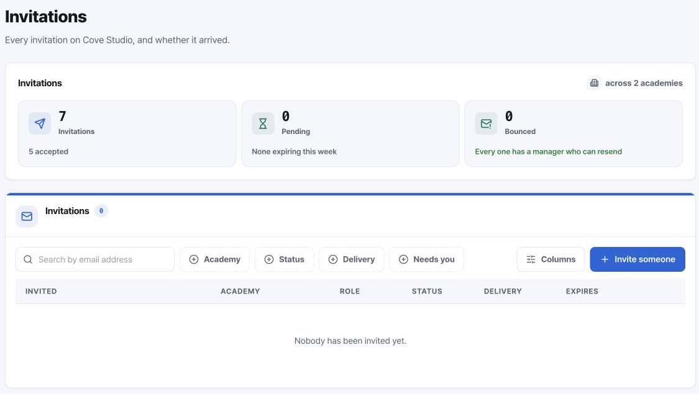

## A14 초대 입력 폼

역할: 플랫폼 관리자. 요구사항: FR-JOIN.

동작: 학원·역할을 선택하고 수신자 이메일을 입력합니다. 링크는 해당 주소에 한해 7일간 유효합니다.

검증 범위: 빈 폼에서는 초대 발송이 비활성화됩니다. 이메일은 발송하지 않았습니다.

출처: https://cs.coveedu.com/admin/invitations

캡처 시각: 2026-09-28T08:04:51.876Z. 자르기 좌표: [464, 134, 977, 644].

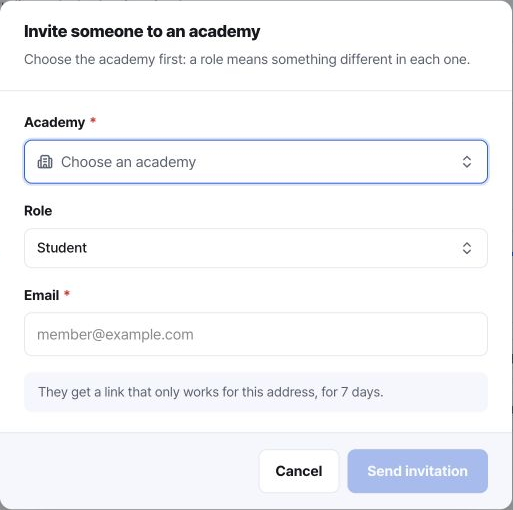

## M01 학원 관리자 개요

역할: 학원 관리자. 요구사항: FR-ANALYTICS.

동작: 역할별 인원, 활성 반, 누락 프로필 및 보고 기간을 표시합니다. 조치 필요 항목에서 후속 작업으로 이동합니다.

검증 범위: 학원 연락처와 학생 행은 잘라냈습니다. 아래 영역의 참여도와 숙련도는 별도 지표입니다.

출처: https://cs.coveedu.com/academy/dlab-mapo

캡처 시각: 2026-09-28T08:05:43.584Z. 자르기 좌표: [288, 303, 1400, 745].

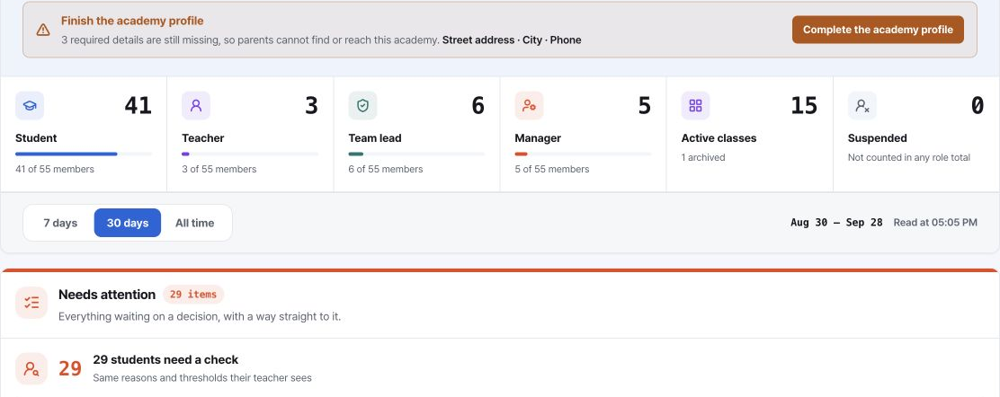

## M02 반 목록

역할: 학원 관리자. 요구사항: FR-CLASS, FR-STAFF.

동작: 상태, 배정 강좌, 등록 수, 담임과 보조 강사 수를 표시합니다.

검증 범위: 열기로 설정에 접근합니다. 검색, 상태, 열 선택 및 페이지 이동으로 반을 찾습니다.

출처: https://cs.coveedu.com/academy/dlab-mapo/classes

캡처 시각: 2026-09-28T08:06:05.058Z. 자르기 좌표: [280, 75, 1405, 730].

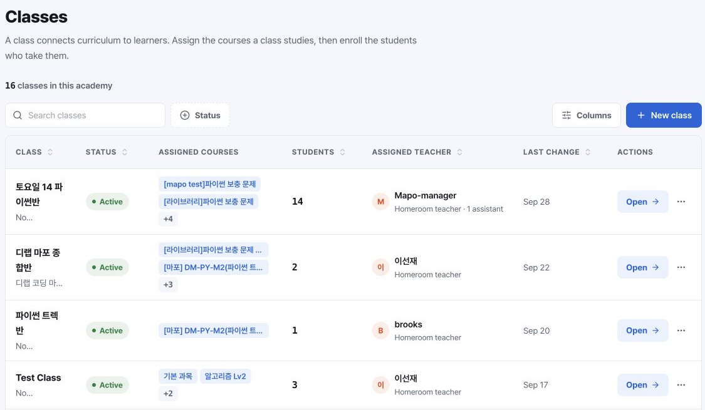

## M03 반 생성 대화상자

역할: 학원 관리자. 요구사항: FR-CLASS.

동작: 반 이름은 필수이고 대상 설명은 선택입니다. 강좌와 학생은 생성 후 추가합니다.

검증 범위: 반 이름은 고유 식별자가 아닙니다. 소스 한도는 이름 120자, 설명 2,000자입니다.

출처: https://cs.coveedu.com/academy/dlab-mapo/classes

캡처 시각: 2026-09-28T08:06:14.132Z. 자르기 좌표: [464, 102, 977, 621].

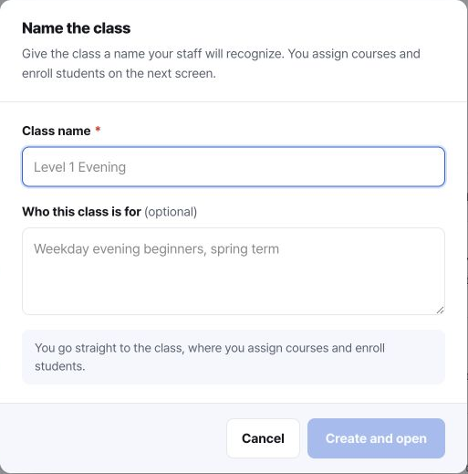

## M04 반 상세

역할: 학원 관리자. 요구사항: FR-CLASS.

동작: 반 헤더가 강좌·학생·강사 정보를 구분합니다. 강좌 배정으로 해당 반의 커리큘럼 범위를 관리합니다.

검증 범위: 일반적인 종료 작업은 보관입니다. 배정 후에도 강좌 공개 여부에 따라 학생 접근을 제한합니다.

출처: https://cs.coveedu.com/academy/dlab-mapo/classes/765ff8da-b032-476d-b403-9d4e7ceac61e

캡처 시각: 2026-09-28T08:06:35.411Z. 자르기 좌표: [280, 75, 1405, 710].

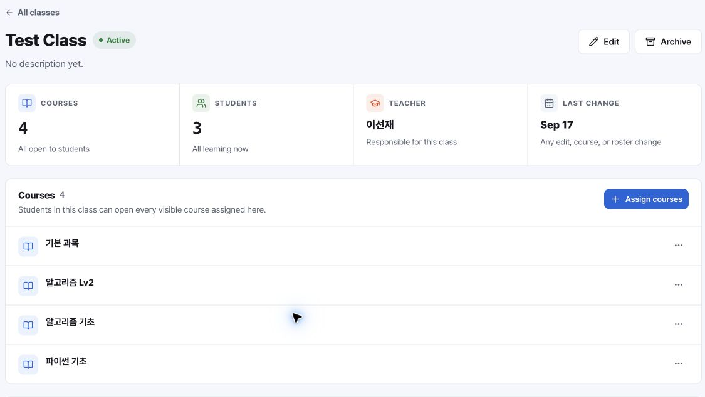

## M05 반 시간표

역할: 학원 관리자. 요구사항: FR-CLASS, FR-POINTS.

동작: 인라인 편집기에서 요일별 시작·종료 시간을 묶습니다. 저장 전 구간 추가·제거가 가능합니다.

검증 범위: 최대 21개 구간과 자정을 넘는 시간을 허용합니다. 시간표가 없으면 출석 포인트를 지급하지 않습니다.

출처: https://cs.coveedu.com/academy/dlab-mapo/classes/765ff8da-b032-476d-b403-9d4e7ceac61e

캡처 시각: 2026-09-28T08:06:49.812Z. 자르기 좌표: [288, 328, 1400, 696].

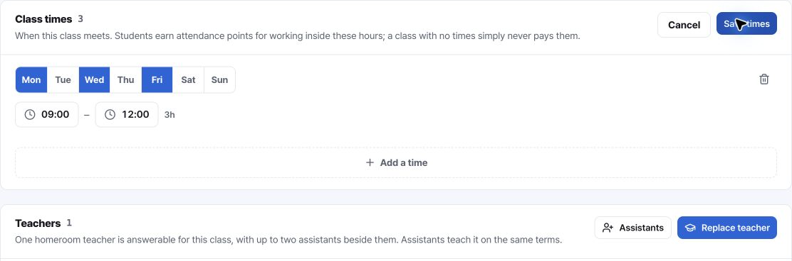

## M06 학원 구성원 목록

역할: 학원 관리자. 요구사항: FR-PEOPLE, FR-ROLE.

동작: 학원 멤버십을 서버 검색·역할·상태 필터·페이지로 조회합니다. 제공 관리자에게 추가 역할 2개가 있습니다.

검증 범위: 필터링된 행은 기본 역할만으로 전체 권한을 설명할 수 없음을 보여 줍니다.

출처: https://cs.coveedu.com/academy/dlab-mapo/people?q=mapo-manager

캡처 시각: 2026-09-28T08:07:25.948Z. 자르기 좌표: [280, 75, 1405, 710].

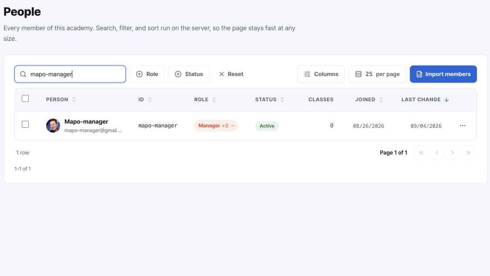

## M07 구성원 파일 가져오기

역할: 학원 관리자. 요구사항: FR-PEOPLE.

동작: CSV·XLSX, 최대 500행·5 MB를 지원합니다. email·role 필수, display_name·send_invitation 선택입니다.

검증 범위: 업로드 후 미리보기를 생성합니다. 검토·확정 후 멤버십·초대를 변경합니다.

출처: https://cs.coveedu.com/academy/dlab-mapo/people?q=mapo-manager

캡처 시각: 2026-09-28T08:07:33.582Z. 자르기 좌표: [272, 127, 1168, 595].

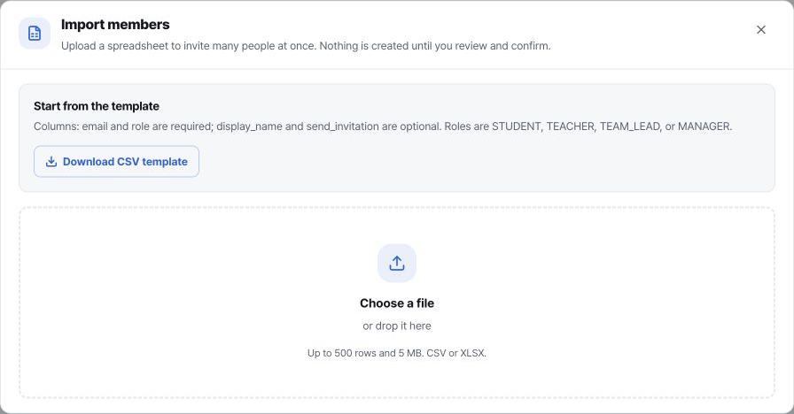

## M08 학원 기능 설정

역할: 학원 관리자. 요구사항: FR-UX, FR-POINTS.

동작: 학원 관리자가 기능을 설정합니다. 반 순위는 포인트에 의존하며 반 현황보다 우선합니다.

검증 범위: 반 순위를 켜면 포인트도 활성화됩니다. 이 동작은 스테이징 검증 대상입니다.

출처: https://cs.coveedu.com/academy/dlab-mapo/settings

캡처 시각: 2026-09-28T08:07:58.181Z. 자르기 좌표: [280, 75, 1405, 710].

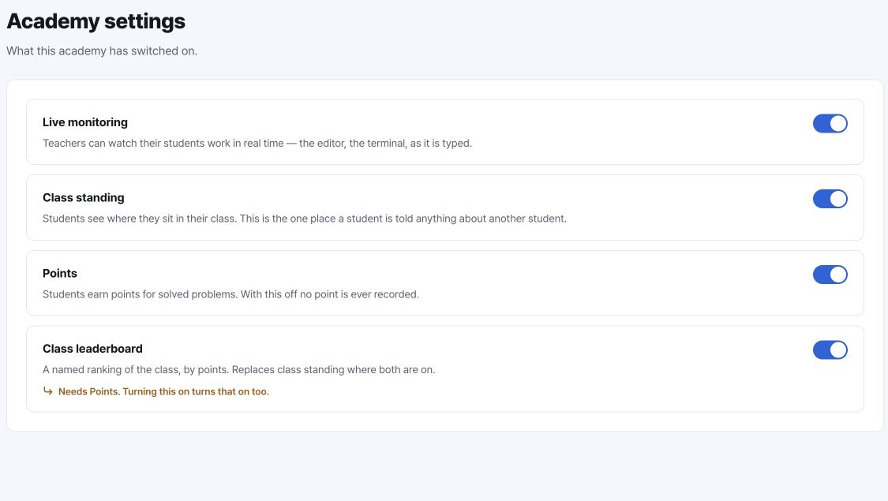

## L01 커리큘럼 준비 상태

역할: 팀장. 요구사항: FR-COURSE, FR-ANALYTICS.

동작: 공개·상위 숨김으로 차단·숨김 문제를 구분합니다. 공개 문제라도 상위가 숨김이면 차단됩니다.

검증 범위: 목록과 명단은 현재 상태이며 효과성은 선택 측정 기간을 사용합니다.

출처: https://cs.coveedu.com/academy/dlab-mapo

캡처 시각: 2026-09-28T08:08:27.005Z. 자르기 좌표: [280, 75, 1405, 683].

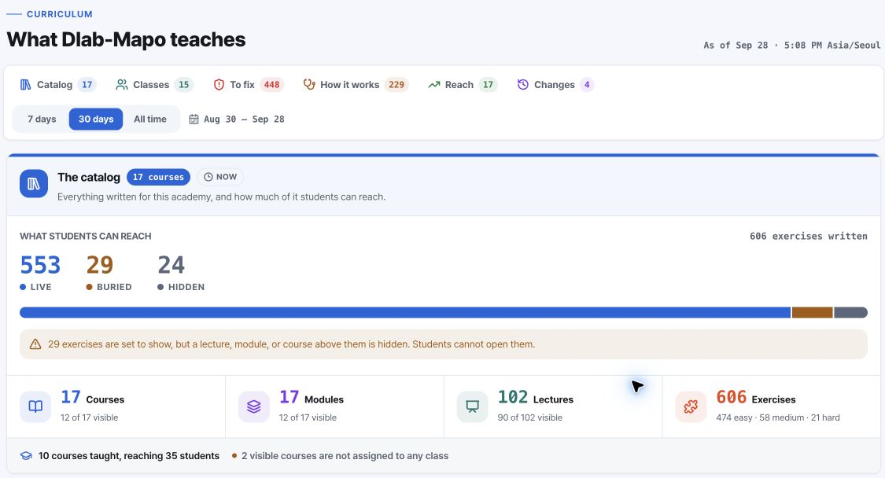

## L02 강좌 목록

역할: 팀장. 요구사항: FR-COURSE, FR-LIBRARY.

동작: 공개 상태와 콘텐츠 수를 표시합니다. 라이브러리 복사본은 원본명, 업데이트 및 수정 상태를 유지합니다.

검증 범위: 최신 상태와 사용자 수정 상태는 동시에 가능합니다. 원본 리비전과 로컬 변경은 별개입니다.

출처: https://cs.coveedu.com/academy/dlab-mapo/content/courses

캡처 시각: 2026-09-28T08:08:49.784Z. 자르기 좌표: [280, 75, 1405, 698].

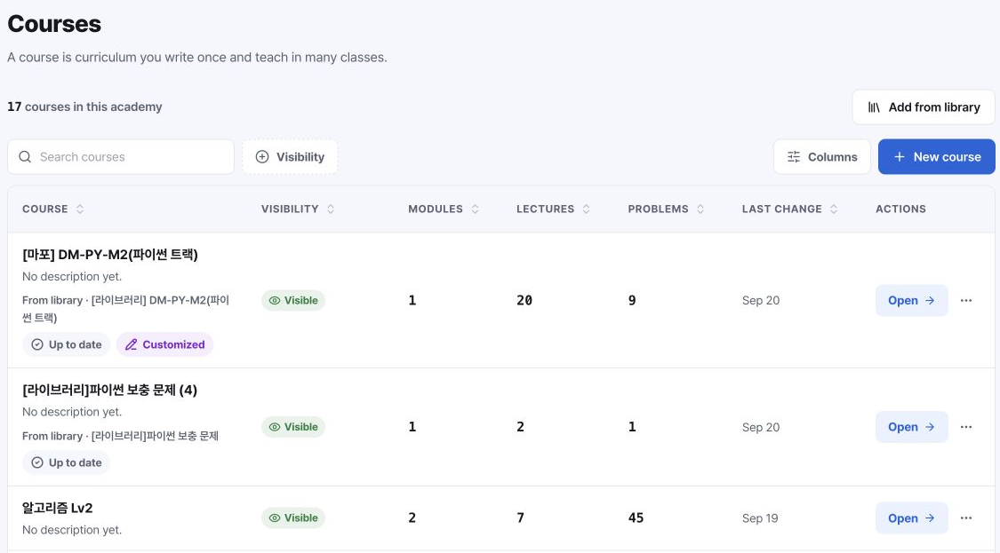

## L03 강좌 계층

역할: 팀장. 요구사항: FR-COURSE.

동작: 모듈 안에 강의, 강의 안에 문제가 있습니다. 각 계층에 공개 제어와 순서가 있습니다.

검증 범위: 모든 콘텐츠 표시는 하위 항목에 적용됩니다. 강좌 게시 스위치는 별도입니다.

출처: https://cs.coveedu.com/academy/dlab-mapo/content/courses/2fde4465-780c-556c-ac91-0812a754cff7

캡처 시각: 2026-09-28T08:09:19.632Z. 자르기 좌표: [280, 75, 1405, 710].

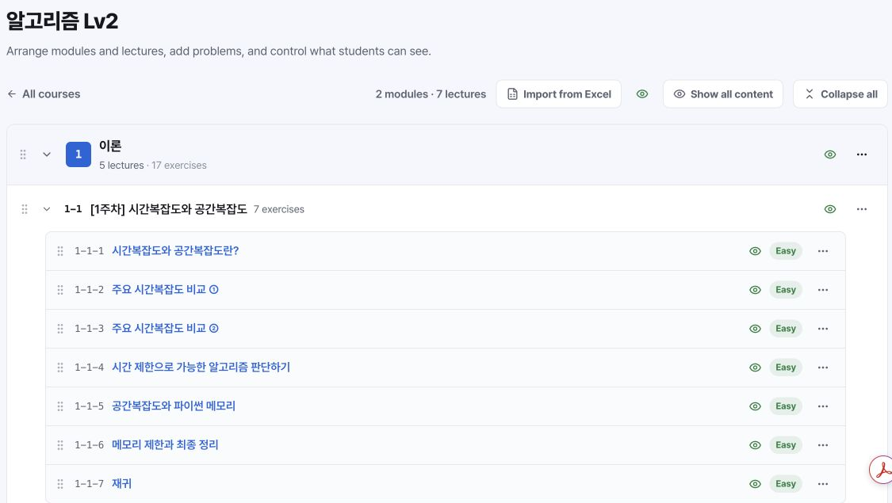

## L04 Excel 가져오기 준비

역할: 팀장. 요구사항: FR-IMPORT.

동작: 준비 후 업로드·검토·결과로 진행합니다. 수정 시 현재 강좌를 내려받아 안정적인 키를 유지합니다.

검증 범위: XLSX 한도는 10 MiB입니다. 행 제거는 콘텐츠 삭제가 아니며 신규 콘텐츠는 숨김으로 생성합니다.

출처: https://cs.coveedu.com/academy/dlab-mapo/content/courses/2fde4465-780c-556c-ac91-0812a754cff7/imports/new

캡처 시각: 2026-09-28T08:09:47.586Z. 자르기 좌표: [280, 75, 1405, 710].

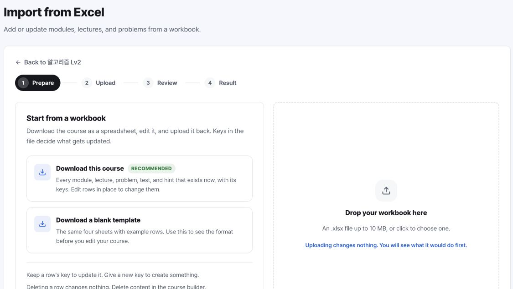

## L05 문제 작성 필드

역할: 팀장. 요구사항: FR-COURSE.

동작: 제목, 난이도, 리치 텍스트 설명으로 시작합니다. 아래에 시작 코드, 정답 코드 및 채점 테스트가 이어집니다.

검증 범위: 빈 폼에는 제목·설명·정답 코드가 필요합니다. 구현 언어는 Python입니다.

출처: https://cs.coveedu.com/academy/dlab-mapo/content/courses/2fde4465-780c-556c-ac91-0812a754cff7/lectures/ce4bbac1-e0a0-52d2-95ea-7ba8b9df3a12/exercises/new

캡처 시각: 2026-09-28T08:10:19.927Z. 자르기 좌표: [280, 75, 1405, 710].

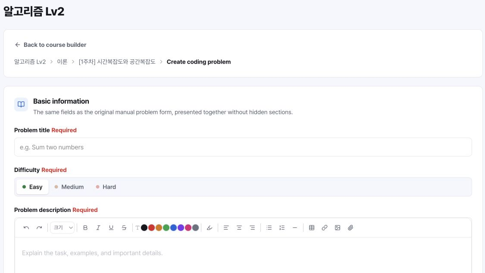

## L06 테스트 및 힌트

역할: 팀장. 요구사항: FR-COURSE, FR-GRADE.

동작: 테스트별 입력·기대 출력·샘플 또는 비공개 상태를 설정합니다. 힌트는 선택이며 순서가 있습니다.

검증 범위: 테스트 없이 저장은 가능하지만 제출은 불가합니다. 학생에게 비공개 기대 출력과 정답 코드를 전달하면 안 됩니다.

출처: https://cs.coveedu.com/academy/dlab-mapo/content/courses/2fde4465-780c-556c-ac91-0812a754cff7/lectures/ce4bbac1-e0a0-52d2-95ea-7ba8b9df3a12/exercises/new

캡처 시각: 2026-09-28T08:10:54.053Z. 자르기 좌표: [280, 75, 1405, 710].

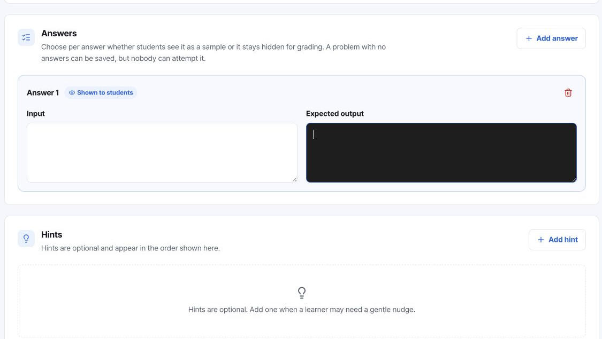

## L07 학원 콘텐츠 라이브러리

역할: 팀장. 요구사항: FR-LIBRARY.

동작: 게시 강좌를 미리 볼 수 있으며 강좌 카드에 기존 로컬 복사본을 표시합니다.

검증 범위: 복사본 도입·업데이트에는 권한이 필요합니다. 이번 검토에서는 목록만 열었습니다.

출처: https://cs.coveedu.com/academy/dlab-mapo/content/library

캡처 시각: 2026-09-28T08:11:17.295Z. 자르기 좌표: [280, 75, 1405, 710].

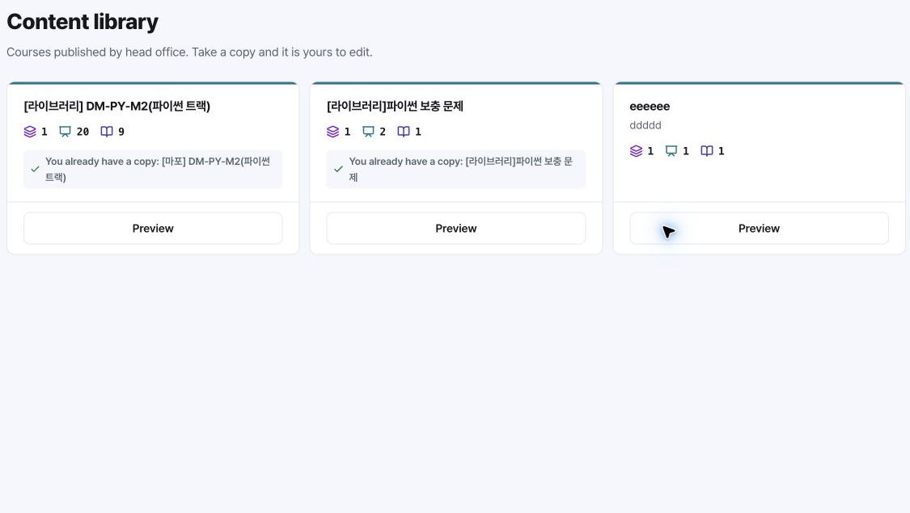

## T01 강사 지도 대기 목록

역할: 강사. 요구사항: FR-ANALYTICS.

동작: 반복 실패·비활성 등 측정 사유에 따라 배정 학생의 지도 우선순위를 표시합니다.

검증 범위: 제공된 학생 부분만 캡처했습니다. 준비도는 강의 시도 학생 최소 3명이 필요합니다.

출처: https://cs.coveedu.com/academy/dlab-mapo

캡처 시각: 2026-09-28T08:11:49.287Z. 자르기 좌표: [288, 82, 1400, 484].

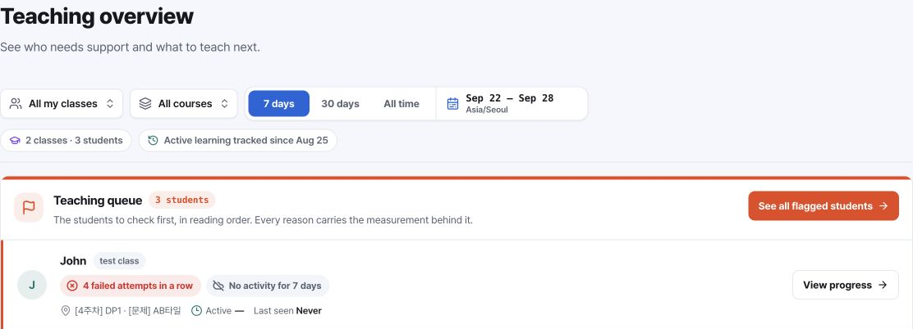

## T02 배정 반

역할: 강사. 요구사항: FR-MONITOR.

동작: 반 카드가 등록·온라인·풀이 중 인원을 구분하며 실시간 명단으로 연결합니다.

검증 범위: 두 반의 수강 좌석 5개는 개요의 고유 학생 3명에 해당합니다.

출처: https://cs.coveedu.com/academy/dlab-mapo/teach/classes

캡처 시각: 2026-09-28T08:12:09.177Z. 자르기 좌표: [280, 75, 1405, 710].

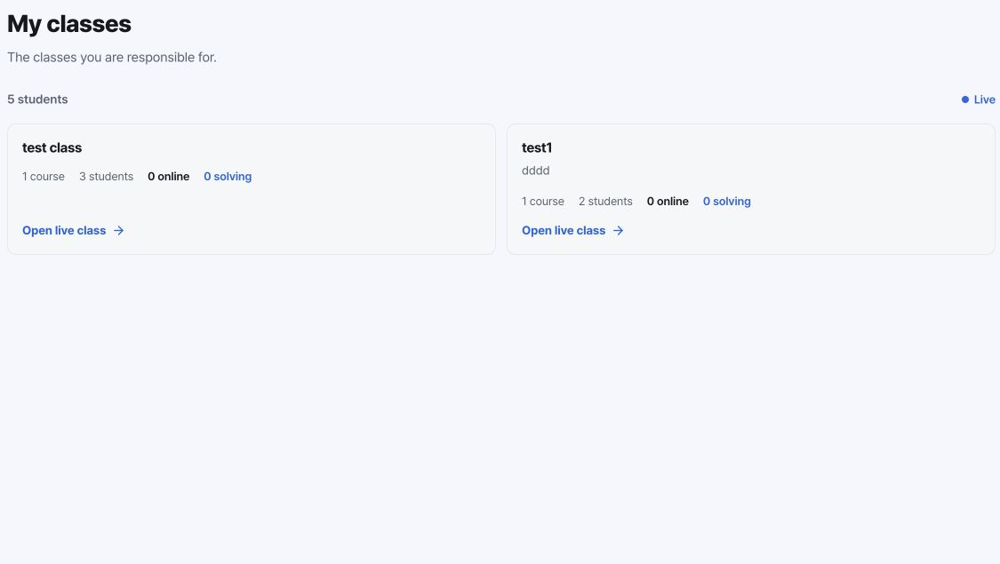

## T03 오프라인 실시간 명단

역할: 강사. 요구사항: FR-MONITOR.

동작: 이름·활동 상태로 명단을 필터링합니다. 제공 학생은 오프라인이며 현재 문제에 참여하지 않습니다.

검증 범위: 실제 오프라인 상태입니다. 활성 관찰, 협업, 터미널 동기화는 미검증 상태입니다.

출처: https://cs.coveedu.com/academy/dlab-mapo/teach/classes/c4f8fecf-26d9-4a62-9d59-ff2498d58f9d

캡처 시각: 2026-09-28T08:12:40.494Z. 자르기 좌표: [280, 75, 1405, 710].

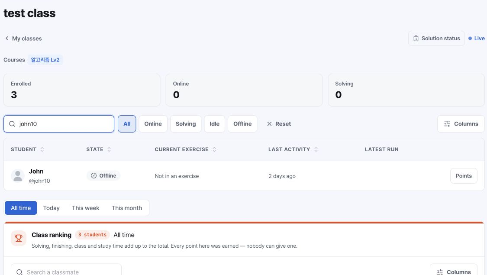

## T04 학생 진도 상세

역할: 강사. 요구사항: FR-RESULT.

동작: 선택 학생의 누적 필수 문제 진도, 시도, 정답 및 주의 문제를 표시합니다.

검증 범위: John의 상세만 캡처했습니다. 문제별·시도별 검토에는 별도 권한 조회를 사용합니다.

출처: https://cs.coveedu.com/academy/dlab-mapo/teach/classes/c4f8fecf-26d9-4a62-9d59-ff2498d58f9d/progress?student=28ffc5b6-9438-4443-838c-41d570587fa5

캡처 시각: 2026-09-28T08:13:04.229Z. 자르기 좌표: [288, 435, 1400, 722].

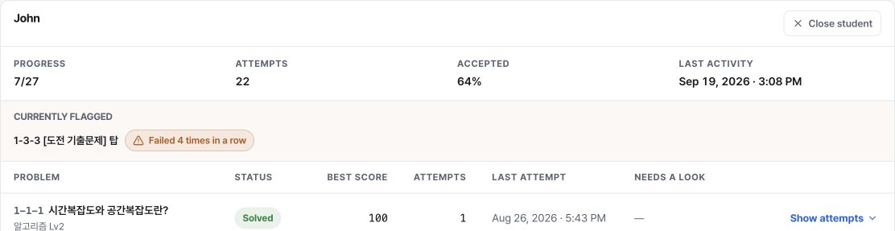

## T05 강사 분석

역할: 강사. 요구사항: FR-ANALYTICS.

동작: 반·강좌·기간 필터로 지표 범위를 정하고 검색으로 제공 학생만 표시합니다.

검증 범위: 점수가 없으면 접근성 텍스트와 대시로 표시합니다. 실제 측정된 0점으로 해석하면 안 됩니다.

출처: https://cs.coveedu.com/academy/dlab-mapo/teach/analytics?search=John

캡처 시각: 2026-09-28T08:13:44.016Z. 자르기 좌표: [280, 75, 1405, 710].

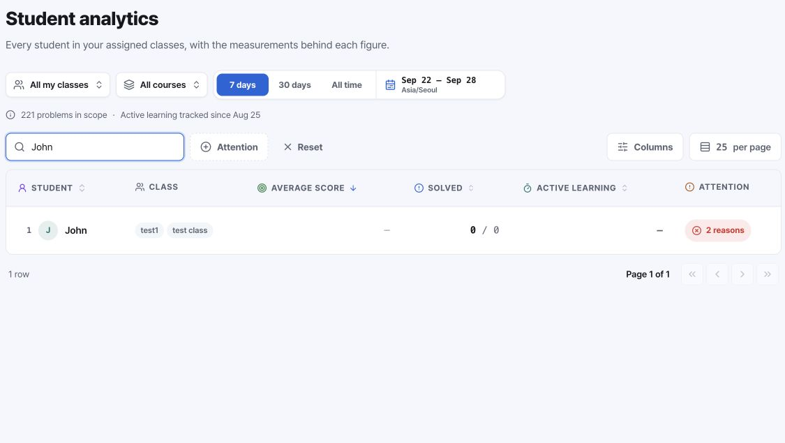

## S01 학생 개요

역할: 학생. 요구사항: FR-LEARN, FR-ANALYTICS.

동작: 계속하기로 최근 작업을 재개합니다. 해결·시도 수, 평균 점수, 집계 학습 시간, 제출 정답률을 표시합니다.

검증 범위: 선택 기간과 본인에 대한 수치이며 학원 전체 통계가 아닙니다.

출처: https://cs.coveedu.com/academy/dlab-mapo

캡처 시각: 2026-09-28T08:14:17.221Z. 자르기 좌표: [288, 82, 1400, 647].

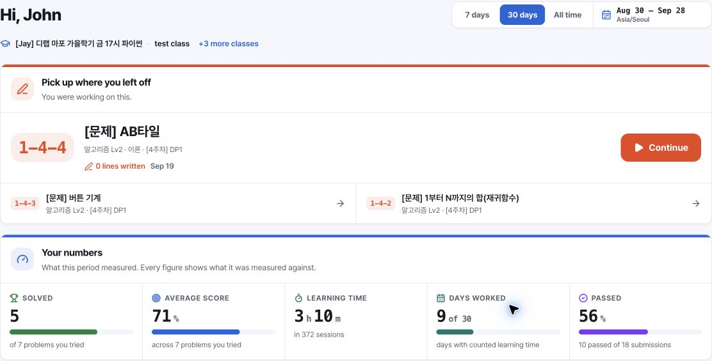

## S02 학습 반 선택

역할: 학생. 요구사항: FR-CLASS.

동작: 같은 강좌가 여러 등록 반에 있으면 학생이 세션·포인트에 사용할 반을 선택합니다.

검증 범위: 선택 classId가 문제 맥락에 포함됩니다. 이름이 비슷해도 서로 다른 반 기록입니다.

출처: https://cs.coveedu.com/academy/dlab-mapo/learn/exercises/a6433bfa-6faa-4310-98b2-52b53b5a7091

캡처 시각: 2026-09-28T08:14:36.923Z. 자르기 좌표: [430, 208, 1010, 515].

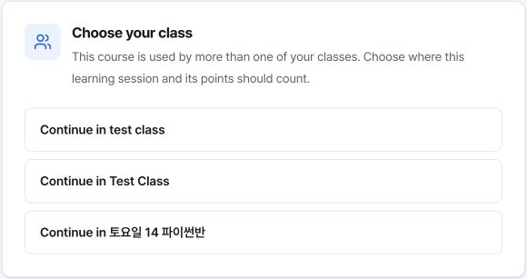

## S03 Python 문제 작업 공간

역할: 학생. 요구사항: FR-LEARN, FR-DRAFT, FR-GRADE.

동작: 실제 작업 공간에 강좌 목차, 문제, 편집기와 터미널이 함께 있습니다. 저장 상태와 타이머도 표시합니다.

검증 범위: 실행과 제출은 별도 작업입니다. 런타임 준비 상태를 확인했지만 코드 실행·편집·제출은 하지 않았습니다.

출처: https://cs.coveedu.com/academy/dlab-mapo/learn/exercises/a6433bfa-6faa-4310-98b2-52b53b5a7091?classId=c4f8fecf-26d9-4a62-9d59-ff2498d58f9d

캡처 시각: 2026-09-28T08:15:20.943Z. 자르기 좌표: [0, 0, 1440, 722].

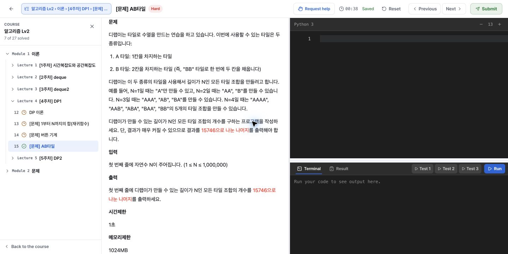

## S04 제출 전 결과 패널

역할: 학생. 요구사항: FR-RESULT.

동작: 결과 탭은 현재 세션의 채점 결과를 보려면 먼저 제출해야 한다고 안내합니다.

검증 범위: 빈 결과 패널의 캡처입니다. 과거 정답 이력으로 새 결과를 만들지 않습니다.

출처: https://cs.coveedu.com/academy/dlab-mapo/learn/exercises/a6433bfa-6faa-4310-98b2-52b53b5a7091?classId=c4f8fecf-26d9-4a62-9d59-ff2498d58f9d

캡처 시각: 2026-09-28T08:15:21.940Z. 자르기 좌표: [821, 451, 1440, 722].

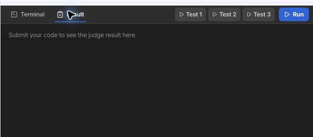

## S05 답안 이력

역할: 학생. 요구사항: FR-RESULT.

동작: 결과, 점수, 통과·전체 테스트 수, 풀이 시간, 제출 시각 및 계층 필터를 표시합니다.

검증 범위: 요약은 전체 이력을 집계합니다. 목록 행에는 비공개 테스트 데이터와 소스 코드가 없습니다.

출처: https://cs.coveedu.com/academy/dlab-mapo/learn/records

캡처 시각: 2026-09-28T08:16:11.455Z. 자르기 좌표: [280, 75, 1405, 696].

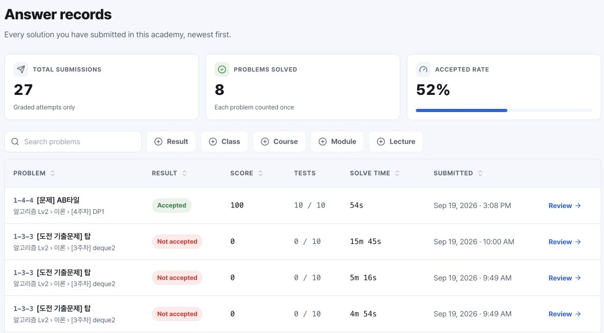

## S06 내 포인트

역할: 학생. 요구사항: FR-POINTS.

동작: 선택 기간·반의 적립 포인트와 아래의 순위·적립 규칙을 확인합니다.

검증 범위: 과거에 문제를 풀었어도 포인트 0은 유효한 상태입니다. 지급 시점과 자격은 별도 검증이 필요합니다.

출처: https://cs.coveedu.com/academy/dlab-mapo/points

캡처 시각: 2026-09-28T08:16:35.852Z. 자르기 좌표: [280, 75, 1405, 710].

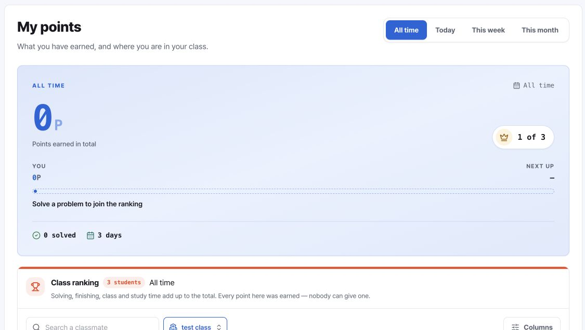

## S07 학생 반 목록

역할: 학생. 요구사항: FR-CLASS.

동작: 등록 반 카드에 강좌 수와 담임을 표시합니다. 반을 열면 해당 커리큘럼 범위로 이동합니다.

검증 범위: 전역 사용자 계정을 추가 생성하지 않고 동일 강좌를 여러 반에 배정할 수 있습니다.

출처: https://cs.coveedu.com/academy/dlab-mapo/learn/classes

캡처 시각: 2026-09-28T08:17:04.750Z. 자르기 좌표: [280, 75, 1405, 710].

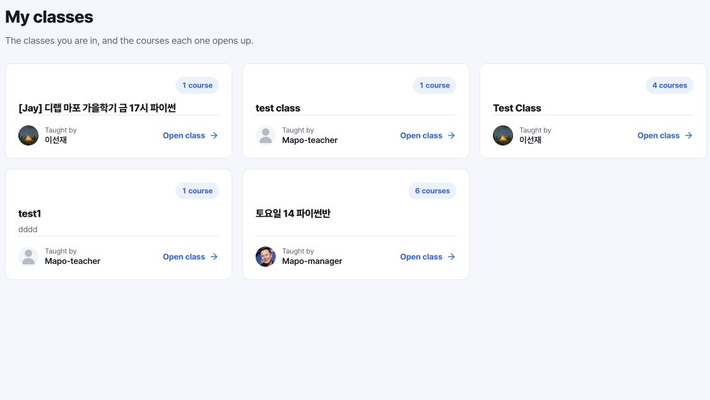

## S08 학생 강좌 및 초안

역할: 학생. 요구사항: FR-LEARN, FR-DRAFT.

동작: 계속 풀기에는 강좌 카드와 별도로 저장 초안이 나타납니다. 초안 폐기는 별도 작업입니다.

검증 범위: 아래에는 문제 0개인 공개 강좌가 준비 중으로 표시됩니다. 이런 강좌가 항상 제외된다고 가정하지 마십시오.

출처: https://cs.coveedu.com/academy/dlab-mapo/learn/courses

캡처 시각: 2026-09-28T08:17:23.501Z. 자르기 좌표: [280, 75, 1405, 580].

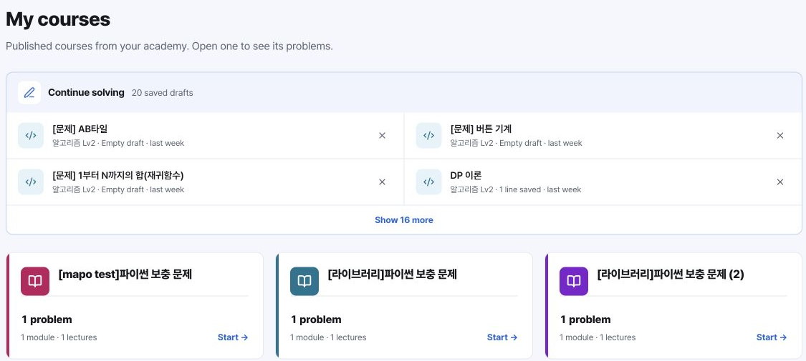

## S09 계정 프로필

역할: 학생. 요구사항: FR-PROFILE.

동작: 전역 표시 이름과 선택 전화번호 옆에 고정 사용자 이름·플랫폼 역할을 표시합니다.

검증 범위: 로그인 이메일과 학원 프로필 상세는 잘라냈습니다. 계정 정보를 저장하지 않았습니다.

출처: https://cs.coveedu.com/academy/dlab-mapo/me

캡처 시각: 2026-09-28T08:18:19.134Z. 자르기 좌표: [482, 203, 1208, 608].

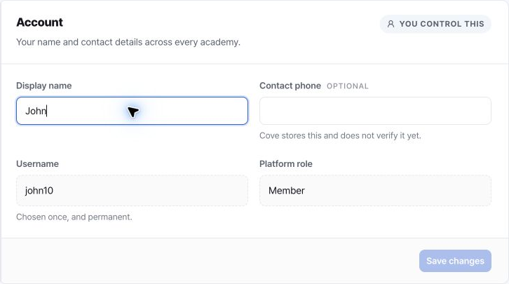
